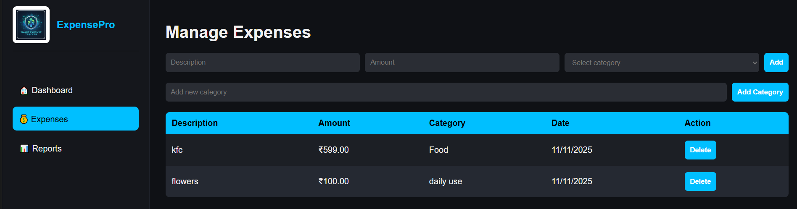
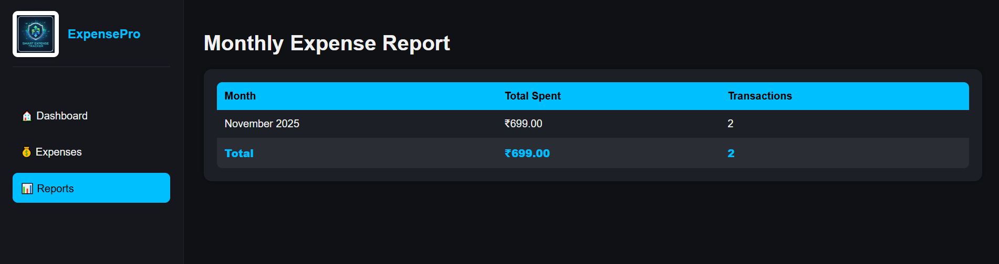

# 💰 ExpensePro Dashboard

A modern, explainable **expense tracking dashboard** built using **Vanilla JavaScript**, **HTML**, and **CSS** — designed with a clean, professional UI for real-world analytics.

---

## 🏠 Project Overview

**ExpensePro** helps users visualize and manage their daily and monthly spending efficiently.  
It offers dynamic category management, persistent data storage, and a sleek analytics dashboard — all without any backend.

---

## 🚀 Features
- 🧾 Add, view, and delete expenses with persistent storage (LocalStorage)
- 🗂️ Create and manage custom categories dynamically
- 📅 Monthly and category-wise expense summaries
- 💼 Professional dark-themed dashboard UI
- 🧠 Modular architecture with clean JavaScript ES6 modules

---

## 🖼️ Project Screenshots

### 🏠 Dashboard View

---

### 💰 Expense Management

---

### 📊 Reports (Monthly Summary)

---

## 📁 Folder Structure
expensepro-dashboard/
├── index.html
├── css/
│   └── style.css
├── js/
│   ├── app.js
│   ├── data.js
│   ├── dashboard.js
│   ├── expenses.js
│   └── reports.js
├── assets/
│   └── logo.png
└── screenshots/
    ├── dashboard-view.png
    ├── expenses-view.png
    └── reports-view.png

---

## 🧰 Tech Stack
- HTML5  
- CSS3  
- JavaScript (ES6 Modules)  
- LocalStorage for persistence  
- Chart.js (optional, deprecated for clean data tables)

---

## 🌐 Live Demo
_Deploy easily on [Netlify](https://netlify.com) or [Vercel](https://vercel.com)_  
Once deployed, add your live link here 👇  
👉 **[View Live Project](https://yourusername.github.io/ExpensePro-Dashboard)**
